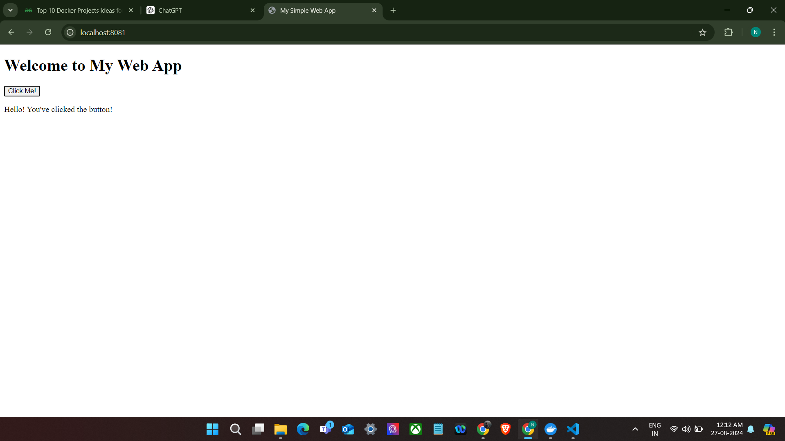

This is a Simple Docker practice project where i have used the Nginx server to deploy the website in the local environment.It has worked perfectly!!!

In this project, I got to learn more about 
            1)Important docker commands
            2)Docker File
            3)Working on Nginx server etc

